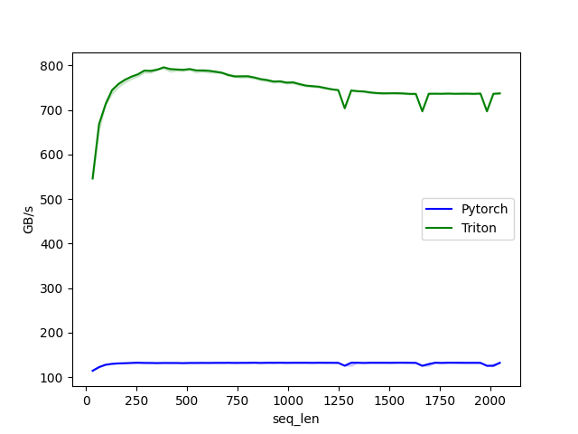

# ai-compiler-study

You will require docker engine compatible with GPU and ~20GB of GPU memory.

## Run

This takes quite long!
```
docker build . -t acs
```

This will drop the result files at `./results`
```
docker run --gpus all --ipc=host --ulimit memlock=-1 --ulimit stack=67108864 -v ./:/workspace acs:latest python main.py
```

## Result

### forward benchmark


### backward benchmark


## References

[1] https://github.com/unslothai/unsloth

[2] https://triton-lang.org/main/index.html