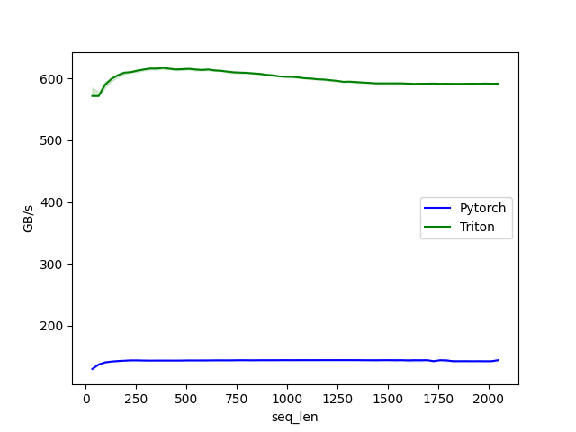

# ai-compiler-study

You will require docker engine compatible with GPU and ~20GB of GPU memory.

## Run

This takes quite long!
```
docker build . -t acs
```

This will drop the result files at `./results`
```
docker run --gpus all --ipc=host --ulimit memlock=-1 --ulimit stack=67108864 -v ./:/workspace acs:latest python main.py
```

## Result


 forward benchmark         | backward benchmark
:-------------------------:|:-------------------------:
   | 

```
[64 rows x 3 columns]
-------------------------------------------------------  ------------  ------------  ------------  ------------  ------------  ------------  ------------  ------------  ------------  ------------
                                                   Name    Self CPU %      Self CPU   CPU total %     CPU total  CPU time avg     Self CUDA   Self CUDA %    CUDA total  CUDA time avg    # of Calls
-------------------------------------------------------  ------------  ------------  ------------  ------------  ------------  ------------  ------------  ------------  ------------  ------------
                                              aten::mul        11.35%      42.000us        15.14%      56.000us      28.000us      21.000us        33.87%      21.000us      10.500us             2
void at::native::elementwise_kernel<128, 2, at::nati...         0.00%       0.000us         0.00%       0.000us       0.000us      21.000us        33.87%      21.000us      10.500us             2
                                              aten::cat        12.16%      45.000us        16.22%      60.000us      30.000us      20.000us        32.26%      20.000us      10.000us             2
                                              aten::add         4.32%      16.000us         5.95%      22.000us      22.000us      13.000us        20.97%      13.000us      13.000us             1
void at::native::vectorized_elementwise_kernel<4, at...         0.00%       0.000us         0.00%       0.000us       0.000us      13.000us        20.97%      13.000us      13.000us             1
                                       cudaLaunchKernel        23.51%      87.000us        23.51%      87.000us      10.875us      12.000us        19.35%      12.000us       1.500us             8
void at::native::(anonymous namespace)::CatArrayBatc...         0.00%       0.000us         0.00%       0.000us       0.000us      12.000us        19.35%      12.000us      12.000us             1
void at::native::(anonymous namespace)::CatArrayBatc...         0.00%       0.000us         0.00%       0.000us       0.000us       8.000us        12.90%       8.000us       8.000us             1
                                              aten::neg         4.86%      18.000us         7.03%      26.000us      26.000us       6.000us         9.68%       6.000us       6.000us             1
void at::native::elementwise_kernel<128, 2, at::nati...         0.00%       0.000us         0.00%       0.000us       0.000us       6.000us         9.68%       6.000us       6.000us             1
-------------------------------------------------------  ------------  ------------  ------------  ------------  ------------  ------------  ------------  ------------  ------------  ------------
Self CPU time total: 370.000us
Self CUDA time total: 62.000us

-------------------------------------------------------  ------------  ------------  ------------  ------------  ------------  ------------  ------------  ------------  ------------  ------------
                                                   Name    Self CPU %      Self CPU   CPU total %     CPU total  CPU time avg     Self CUDA   Self CUDA %    CUDA total  CUDA time avg    # of Calls
-------------------------------------------------------  ------------  ------------  ------------  ------------  ------------  ------------  ------------  ------------  ------------  ------------
                                             TritonRoPE        12.38%     291.000us        99.70%       2.344ms       2.344ms      11.000us        84.62%      13.000us      13.000us             1
                       rope_fw_bw_kernel_0d1d2d3d4d5d6d         0.00%       0.000us         0.00%       0.000us       0.000us      11.000us        84.62%      11.000us      11.000us             1
                                              aten::cos        83.67%       1.967ms        84.81%       1.994ms       1.994ms       1.000us         7.69%       1.000us       1.000us             1
void at::native::vectorized_elementwise_kernel<4, at...         0.00%       0.000us         0.00%       0.000us       0.000us       1.000us         7.69%       1.000us       1.000us             1
                                              aten::sin         0.55%      13.000us         0.85%      20.000us      20.000us       1.000us         7.69%       1.000us       1.000us             1
void at::native::vectorized_elementwise_kernel<4, at...         0.00%       0.000us         0.00%       0.000us       0.000us       1.000us         7.69%       1.000us       1.000us             1
                                          aten::squeeze         0.43%      10.000us         0.55%      13.000us      13.000us       0.000us         0.00%       0.000us       0.000us             1
                                       aten::as_strided         0.13%       3.000us         0.13%       3.000us       3.000us       0.000us         0.00%       0.000us       0.000us             1
                                          aten::reshape         0.13%       3.000us         0.51%      12.000us       6.000us       0.000us         0.00%       0.000us       0.000us             2
                                             aten::view         0.38%       9.000us         0.38%       9.000us       4.500us       0.000us         0.00%       0.000us       0.000us             2
-------------------------------------------------------  ------------  ------------  ------------  ------------  ------------  ------------  ------------  ------------  ------------  ------------
```
Self CPU time total: 2.351ms
Self CUDA time total: 13.000us

## References

[1] https://github.com/unslothai/unsloth

[2] https://triton-lang.org/main/index.html